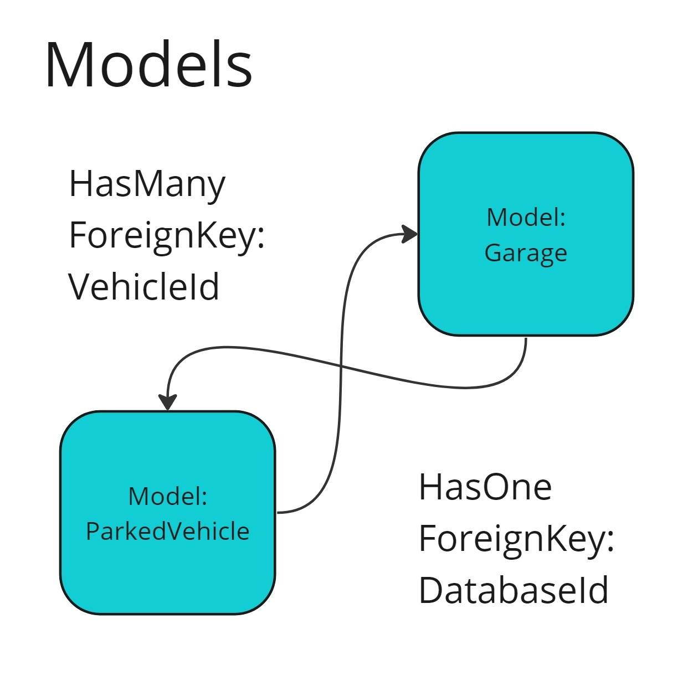
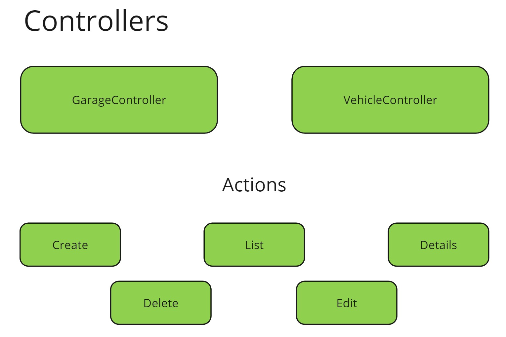
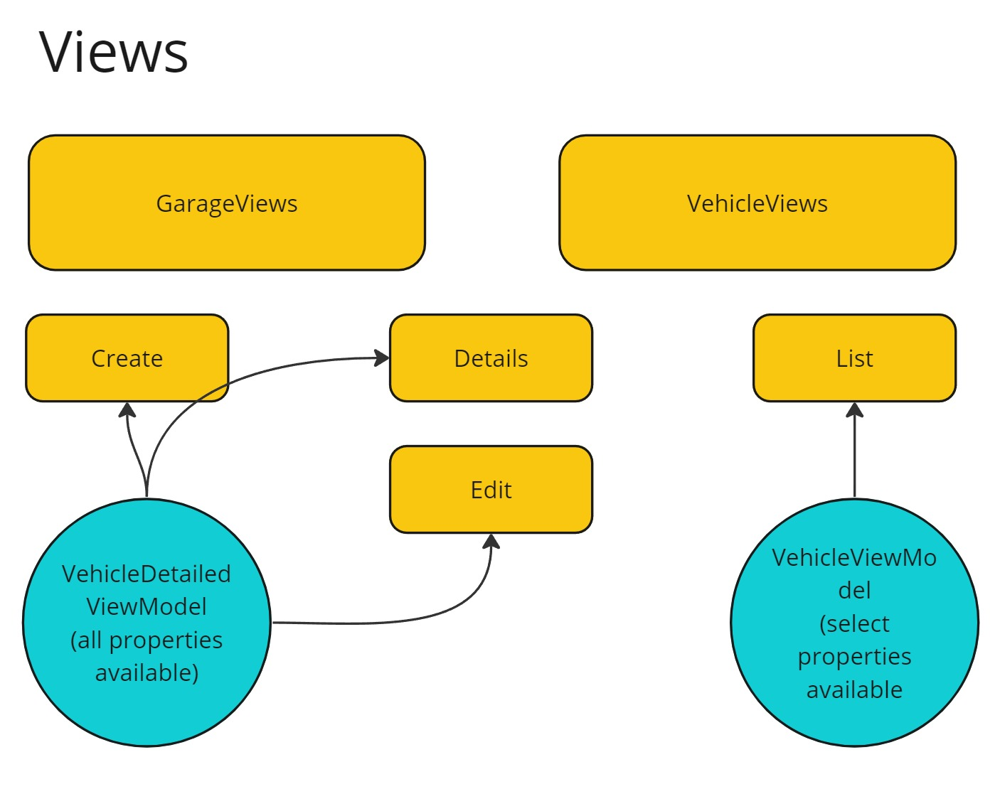

# Garage 2.0

## Description
An MVC (Model View Controller) application to handle the registration/deregistration of Vehicles in select Garages

## Data structure




## Testing/Development
 Run the application in Visual Studio after updating the database via NuGet package manager.
 Alternatively, use your *nix enviromnet of choice and follow the below instructions.

```
# *nix terminal
# Requires .NET SDK 8.x as well as dotnet-ef tools to be available 

cd Storage
dotnet ef database update
dotnet watch run
```

## Contact
[visualarea.1@gmail.com](mailto:visualarea.1@gmail.com)
